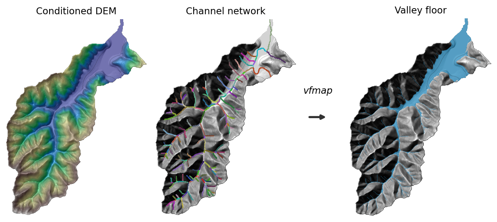

# vhs (Valley Hillslope Separator)

A Python package for delineating valley floors from digital elevation models (DEMs).



Valley floors are the topographic region between valley walls shaped mainly by fluvial
processes, composed of floodplains, terraces, alluvial fans, and channels. From a DEM,
a HAND (height above nearest drainage) raster, and a reach-labeled channel network with
matching subbasins, `vhs` produces a binary valley floor raster.

The method combines two components:

1. **Region growing** — low-slope pixels connected to the channel network. Captures
   wider, unconfined valley floors with multiple channels and floodplains.
2. **Reach flooding** — reach-specific relative elevation thresholds derived from
   cross-section analysis. Captures narrow, confined valley floors bounded by steep
   hillslopes.

## Installation

```bash
pip install "git+https://github.com/avkoehl/vhs.git"
```

## Usage

With your own HAND, channel network, and subbasins (all `xarray.DataArray`s on the
same grid; channel network is a reach-labeled raster whose IDs match the subbasins):

```python
from vhs import map_valley_floor, Parameters

valley_floor = map_valley_floor(
    dem=dem,
    hand=hand,
    channel_network=channel_network,
    subbasins=subbasins,
    params=Parameters(),   # optional; defaults shown in the table below
)
```

### Parameters

```python
from vhs import Parameters

params = Parameters(
    region_slope_threshold=2.0,   # degrees, tighter region growing
    flood_percentile=90.0,        # higher HAND threshold per reach
    min_hole_size=20_000,         # m², smaller holes filled
)
valley_floor = map_valley_floor(dem, hand, channel_network, subbasins, params=params)
```

Parameters can be saved and reloaded as JSON with `params.to_json(path)` and
`Parameters.from_json(path)`.

## Configuration parameters

All parameters live on the `Parameters` dataclass, grouped by pipeline stage.

#### Headwater filtering

| Parameter | Default | Unit | Description |
|---|---|---|---|
| `headwater_min_length` | 1,000 | m | Tip reaches shorter than this are treated as headwaters and dropped from valley-floor mapping (their channel pixels are reattached at the end). |
| `headwater_max_mean_slope` | 5.0 | degrees | Tip reaches whose mean channel slope exceeds this are treated as headwaters and dropped. |

#### Region growing

| Parameter | Default | Unit | Description |
|---|---|---|---|
| `region_smooth_sigma` | 90 | m | Gaussian smoothing length applied to the slope surface before region growing; larger values bridge small rough patches. |
| `region_slope_threshold` | 3.0 | degrees | Maximum slope for a pixel to be grown into the valley floor from the channel network; lower values give tighter, more confined floors. |

#### Cross-section sampling

| Parameter | Default | Unit | Description |
|---|---|---|---|
| `xs_interval_distance` | 100 | m | Spacing between cross-sections sampled along each reach. |
| `xs_length` | 1,500 | m | Total length of each cross-section (extends this far to either side of the channel). |
| `xs_point_spacing` | 10 | m | Spacing between elevation sample points along each cross-section. |

#### Reach flooding

| Parameter | Default | Unit | Description |
|---|---|---|---|
| `flood_steep_slope` | 10.0 | degrees | Minimum slope for a cross-section segment to count as a valley wall when detecting slope breaks. |
| `flood_min_elevation_gain` | 10.0 | m | Minimum elevation gain across a steep segment to confirm it as a valley wall (slope-break point). |
| `flood_default_hand` | 10 | m | Fallback HAND threshold used for a reach when too few valid slope-break points are found. |
| `flood_percentile` | 85.0 | percentile | Percentile of slope-break HAND values used as the reach's flood threshold; higher values flood wider. |
| `flood_min_points` | 10 | count | Minimum number of valid slope-break points a reach needs before its threshold is computed from data instead of the default. |

#### Postprocessing

| Parameter | Default | Unit | Description |
|---|---|---|---|
| `min_hole_size` | 40,000 | m² | Holes in the valley floor smaller than this are filled; set to 0 to disable hole filling. |
| `max_slope` | 15.0 | degrees | Pixels steeper than this are removed from the final valley floor. |
